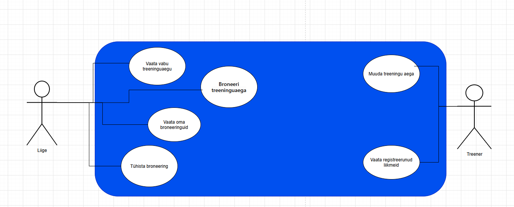
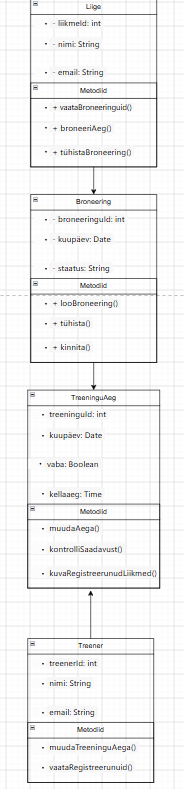
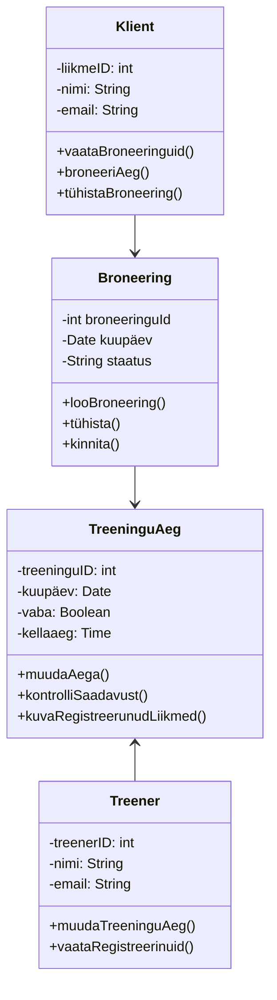

# Jousaali-broneering
Liikmed broneerivad treeninguaega, treener näeb broneeringute nimekirja.
Tegijad: [Nikita Popovych], [Nikita Kirejev] Grupp [NPTV24]

## Kasutajad ja nõuded

Süsteemil on kaks rolli: liige ja treener. Kuus kasutajalugu on GitHubi Issues all ning tähtsamad nõuded on märgitud must sildiga. 

# Arendusmudel

Valisime inkrementaalse mudeli, sest nii saab süsteemi teha osade kaupa. Kõigepealt teeme vabade aegade vaatamise ja treeningu broneerimise. Seejärel lisame broneeringute tühistamise ja treenerile registreerunud liikmete nimekirja. Nii saab iga osa eraldi kontrollida ja süsteemi järk-järgult parandada. Kosemudel meile ei sobi, sest arendamise käigus võivad tekkida muudatused ja uued nõuded.

## Diagrammid

## Projekti tüübid

### (a) Uus funktsioon: Treeningu aja muutmine
-Tüüp: olemasoleva süsteemi arendus
-Mis muutub: treener saab muuta treeningu kuupäeva ja kellaaega.
-Mis jääb samaks: liikmed, registreerumised ja muu süsteemi loogika.
-Peamine risk: liikmetele kuvatakse vale treeningu aeg.
-Esimene samm: kontrollime, milliseid klasse ja ekraane tuleb muuta.

### (b) Üleviimine: PHP 5 + MySQL → Node.js + PostgreSQL
- Tüüp: üleviimine uuele platvormile
- Mis muutub: kogu rakenduse kood ja andmebaas; muutuvad klassid Liige, Broneering, TreeninguAeg ja Treener ning nende andmebaasi tabelid
- Mis jääb samaks: kõik viis kasutuslugu, süsteemi põhifunktsioonid, kasutajate andmed ja broneeringute loogika
- Peamine risk: Broneeringute seosed liikmete ja treeninguaegadega võivad üleviimisel kaduma minna või valesti seostuda
- Esimene samm: teeme vanast andmebaasist varukoopia ja loendame tabelite andmed (Liige, Broneering, TreeninguAeg, Treener), et pärast üleviimist saaksime kontrollida, et kõik andmed on alles

### (c) Liidestamine: Google Calendar
- Tüüp: liidestamine
- Mis muutub: lisame Google Calendariga ühenduse ja võimaluse lisada broneeritud treeninguaeg kalendrisse
- Mis jääb samaks: kõik viis kasutuslugu, olemasolevad klassid Liige, Broneering, TreeninguAeg ja Treener ning broneerimise loogika
- Peamine risk: treeningu kuupäev ja kellaaeg võivad Google Calendarisse saata vale ajaga või vale sündmus võib sattuda vale liikme kalendrisse
- Esimene samm: uurime Google Calendar API võimalusi ja määrame, milliseid andmeid süsteem peab kalendrisse saatma
- Saadame: treeningu kuupäeva, kellaaja ja treeningu andmed
- Saame vastu: Google Calendarisse loodud sündmuse ID ja kinnituse, et sündmus lisati

# Inkrementaalselt või iteratiivselt ja miks
Tegime maketi inkrementaalselt, sest nii saime ühe ekraani valmis teha ja kontrollida enne teise ekraani tegemist.

# Kuidas me töötasime

Tahvli alguse ja lõpu pildid asuvad kaustas protsess/.

Kõige paremini läks ülesannete jagamine ja koos töötamine. Kõige raskem oli GitHubi harude ja pull requestide kasutamine. Järgmisel korral planeeriksime töö etapid varem ja jagaksime ülesanded täpsemalt.

# Mermaid Class Diagramm CODE

# Diff
Diff näitab, millised read ja muudatused lisati, kustutati või muudeti kahe versiooni vahel.

## Vahendid
Meie süsteemi jaoks valime draw.io, sest see on tasuta ja seda on lihtne kasutada. Me ei vali Mermaidit, sest selle õppimine on keerulisem ja koostöö on piiratum. Kui meeskond oleks suurem, valiksime samuti draw.io, sest seal on mugav koos diagramme luua.

## Projekti kaart

**Tellija:** Nikita Kirejev jõusaali juhataja

**Probleem:** Jõusaali liikmetel on raske leida sobivat treenerit ja vaba aega. Treenerid peavad broneeringuid käsitsi haldama.

**Eesmärk:** 1. detsembriks saavad liikmed veebis valida treeneri, näha tema vabu aegu ja broneerida treeningu.

**Tulemus:**
Treenerite nimekiri

Vabade aegade vaatamine

Treeningu broneerimine ja tühistamine

Oma broneeringute vaatamine

**Ulatus SEES:** 

Kasutaja registreerimine ja sisselogimine

Treenerite vaatamine

Vaba aja valimine

Broneeringute haldamine

**Ulatus VÄLJAS:** 

Online-maksed

Videotreeningud

Mobiilirakendus

**Kolmnurk:** aeg: fikseeritud; raha/inimesed: 2 inimest; ulatus: paindlik.  Fikseeritud on aeg ja meeskonna suurus.

**Rollid:** tellija — jõusaali juhataja; projektijuht — üks meeskonnaliige; meeskond — 2 õpilast ja Nikita Kirejev ja Nikita Popovych; huvipooled — liikmed ja treenerid ja Nikita Popovych.

| Risk | Tõenäosus 1–3 | Mõju 1–3 | Mida teeme enne |
|---|---|---|---|
| Treenerite ajad ei salvestu õigesti | 2 | 3 | Testime broneerimist |
| Tekib topeltbroneering | 2 | 3 | Kontrollime vabu aegu |
| Projekt ei valmi tähtajaks | 2 | 3 | Teeme põhifunktsioonid esimesena |

**Edukriteerium:** Liige saab valida treeneri, leida vaba aja ja teha broneeringu.

